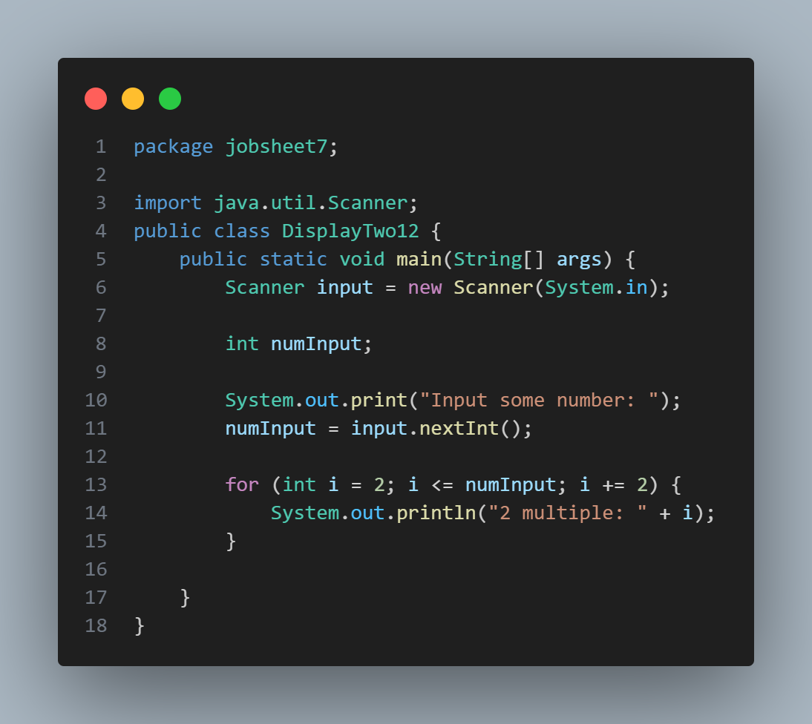
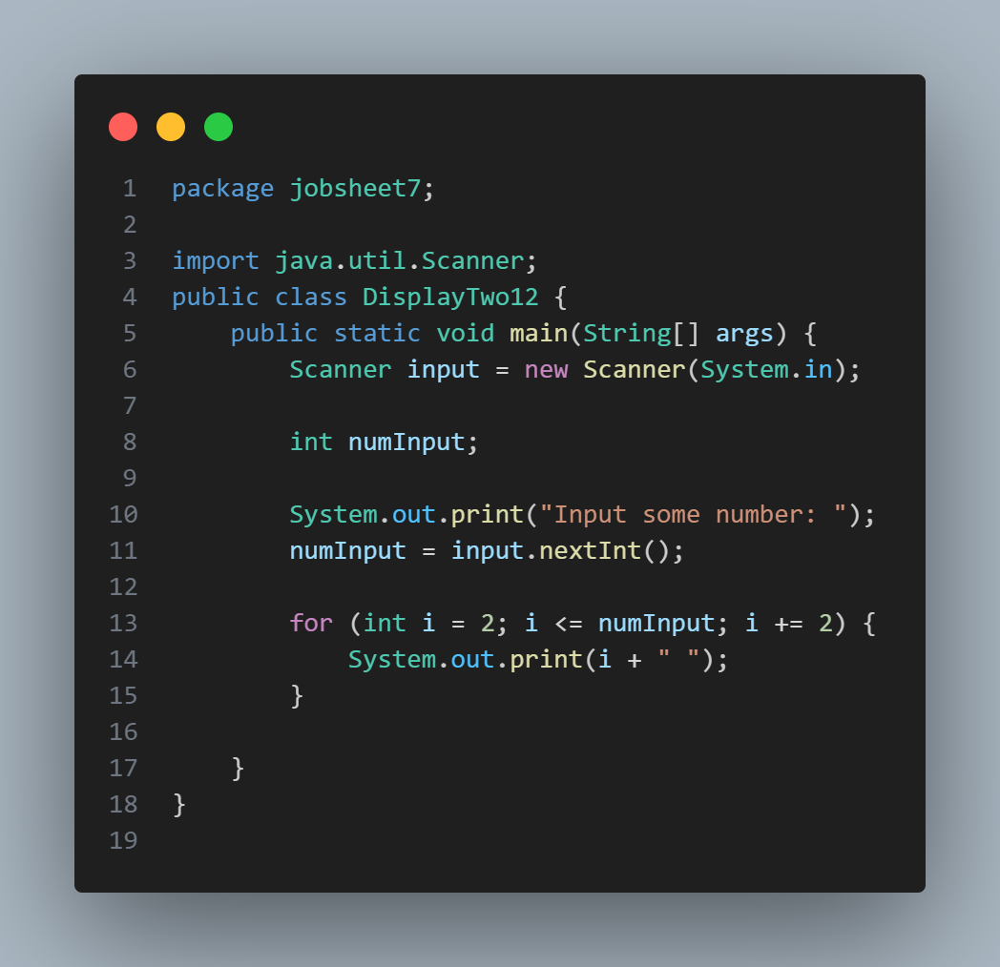
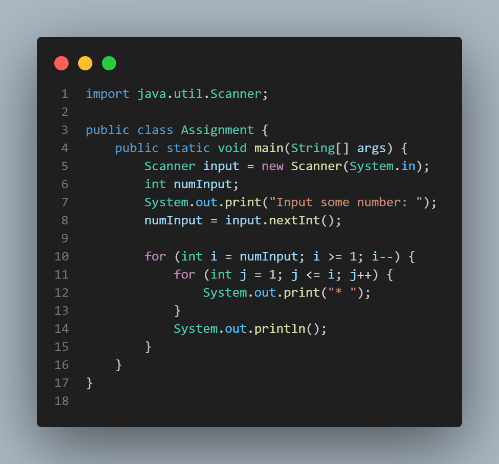

## Question 1

1. There are 3 main components in FOR loop. Based on experiment 1 above, identify and explain these 3 components!  

*a. Initialization = creates the variable i, b. Condition = deciding how long the loop wil continue running, c. Increment = updates the loop after each cycle*

2. Explain how the following code works!
 for(int i = 1; i <= 50; i++) {
            if(i % multiple == 0) {
                sum = sum + i;
                counter++;
            }
        }

*i is 1, if i is less than or equal to 50 than add 1 to i. the if checks if the modulus of i is 0, if true the number i is added to the total of sum. Also the program adds 1 to counter to count how many multiples have been found.*

3.  Modify the existing code by adding a new variable to calculate the average of all the 
specified multiples!

*average = (double)sum / counter;*

## Question 2

1. Do modification to make the program produce similar result but WITHOUT IF statement. 
* 

2. Do modification to make the program print like this following result. Please insert a 
screenshot of your code to the report. 
* 

## Question 3

1. Do a modification on the program therefore your program utilize FOR statement 
rather than WHILE statement. 

for (int i = 0; i < numInput; i++) {
            s += " *";
            System.out.println(s);

2. Explain the meaning of s += “ *” and why is it possible?

*it means that the s = s + "*", its possible because using += is the same with s = s +*

## Question 4

1. What is the use of the BREAK within the loop syntax? 

*To stop the loop*

2. Modify the program so that if the number of leave days requested is greater than the 
remaining entitlement, the program does not stop, allowing the user to enter the 
number of days according to the entitlement. 

* do { 
            
            System.out.print("Do you want to take a leave? (y/n)? ");
            confirmation = input.next();

            if (confirmation.equalsIgnoreCase("y")) {
                System.out.print("How many day(s)? ");
                numLeave = input.nextInt();

                if (numLeave <= leaveEntitlement) {
                    leaveEntitlement -= numLeave;
                    System.out.println("Remaining leave entitlement: " + leaveEntitlement);
                } else {
                    System.out.println("You don't have enough leave entitlement.");
                    break;
                }
            }
        } while (leaveEntitlement > 0);*

4. When typing "t" as the confirmation input, what happens? Why? 

*The program will ask again because we only put y as a confirmation input*

5. Modify the program code so that when the user enters "t" as the confirmation input, the 
program will stop. 

* }else if (confirmation.equalsIgnoreCase("t")) {
                break;
            }*

## Assignment
1. * 